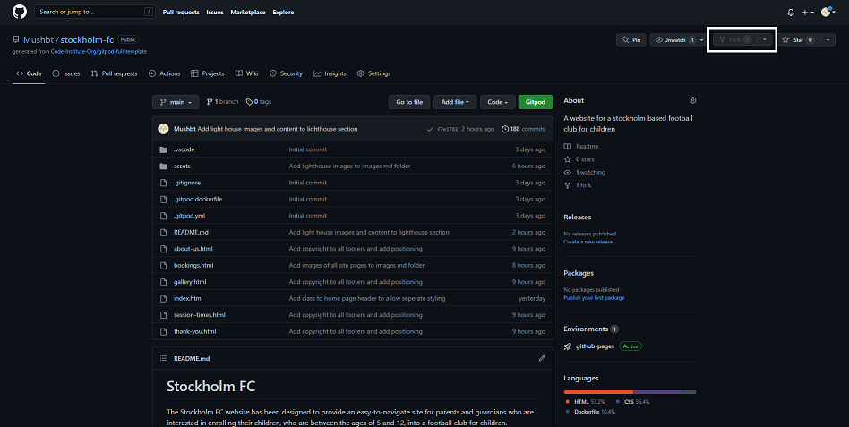

# Stockholm FC

The Stockholm FC website has been designed to provide an easy-to-navigate site for parents and guardians who are interested in enrolling their children, who are between the ages of 5 and 12, into a football club for children.

The live link to the Github repository can be found here - (https://mushbt.github.io/stockholm-fc/)

# Contents

* [**User Experience UX**](<#user-experience-ux>)
    *  [User Stories](<#user-stories>)
    * [Wireframes](<#wireframes>)
    * [Site Structure](<#site-structure>)
    * [Design Choices](<#design-choices>)
    *  [Typography](<#typography>)
    *  [Colour Scheme](<#colour-scheme>)
* [**Features**](<#features>)
    * [Home](<#home-page>)
    * [Navigation menu](<#navigation-menu>)
    * [About-us](<#about-us>)
    * [Gallery](<#gallery>)
    * [Session-times](<#session-times>)
    * [bookings](<#bookings>)
    * [thank-you](<#thank-you>)
    * [Footer](<#footer>)
* [**Future Features**](<#future-features>)
* [**Technologies Used**](<#technologies-used>)
* [**Testing**](<#testing>)
* [**Deployment**](<#deployment>)
* [**Credits**](<#credits>)
* [**Content**](<#content>)
* [**Media**](<#media>)
*  [**Acknowledgements**](<#acknowledgements>)

# User Experience (UX)

## User Stories

* As a user, I want to be able to know what the website is about as soon as I enter the site.
* As a user, I want to be able to navigate easily and smoothly through the site.
* As a user, I want information on who and what is Stockholm FC and why I should enroll my children to their football club.
* As a user, I want to see images of their football sessions.
* As a user, I want to know what day and time they have their sessions.
* As a user, I want to know the location of the sessions they hold.
* As a user, I want to be able to request more information via mail or phone.
* As a user, I want to be able to fill out a simple form to start my childs enrolment. 

[Back to top](<#contents>)

## Wireframes

The wireframes for Stockholm FC were produced in [Balsamiq](https://balsamiq.com). There are frames for a full width display and a small mobile device. The final site varies a little due to some changes being made during development.

 

[Back to top](<#contents>)

## Site Structure

The Stockholm FC website has 5 visible pages. The [home page](index.html) which is the Landing page, [about us](about-us.html), [gallery](gallery.html), [session times](session-times.html) and [bookings](bookings.html). All 5 visible pages are accessible from the navigation menu which is located on the top of all pages. There is a learn more button on the home page which takes you to the about us page. There is also a book now button on all the other visible pages with exception to the bookings page. There is an extra [thank you](thank-you.html) page once you have filled out the form on the bookings page.

[Back to top](<#contents>)

## Design Choices

 * ### Typography
      The fonts chosen were 'Rokkitt' for the headings and 'Raleway' for the body text. They fall back to sans and sans-serif respectively. 
     * 'Rokkitt' was chosen as the header font because it compliments the body font. I focused on the body font because I felt the important information would be in the body.
     * 'Raleway' is used for the body text as it is a simple and easy to read font.

 * ### Colour Scheme
      I decided to stick with simplicity when deciding the color scheme for the site. That is why I went with black and shades of grey as the main color scheme.
      I added small details of bright yellow which really complemented the simple design.

[Back to top](<#contents>)

# Features

The Stockholm FC site was made to be simple and easy to use. The thought behind this was that parents should not be overwhelmed with information and complicated navigation. For parents that do need further information, they have an easy form on the bookings page.

## Existing Features  
  * ### Navigation Menu

    * Located at the top of all the pages in the site, it is responsive and contains links to all the pages of the site to allow ease of navigation in one location.
    * The logo is clickable with a link back to the home page for enhanced UX.

[Back to top](<#contents>)

* ### Home
    
    * This is the landing page, where potential visitors will come to once they have entered the site. I have used a background image of a young child shooting a football. The reason behind this was that I did not feel I would need to add any further information on what the site was about as the image was self-explanatory alongside keeping everything simple.
    * A persuasive header, along with a learn more button was placed next to the image which gives the visitors a close enough button to move on to the next page which is the about us page.
    

[back to top](<#contents>)

* ### About Us

     * The About us page gives the user more information about Stockholm FC.
     * Three sections were added and they are as followed:
     * Who We Are - Who we are as a football club.
     * What We Believe - What we believe is beneficial for children who are taking the exciting step into football.
     * What We Focus On - Where our focus will be to get their children into the sport of football.
     
     * A book now button was added which takes the user to the bookings page in case they are persuaded enough to choose this football club for their children.

[Back to top](<#contents>)

* ### Gallery

     * The Gallery page gives the user an insight into the sessions that we hold.
     * Images have been laid out into separate 'cards' to allow more focus per image rather than have them all contained in one page section.
     * A book now button was added which takes the user to the bookings page in case they are persuaded enough to choose this football club for their children.

[Back to top](<#contents>)

* ### Session Times

     * The Session Times page gives the user information on location, and what days and times we hold our sessions for the different age groups we cater to.
     * A map of the location has also been added to make it simple for the user rather than having to search up the address on the internet.
     * A book now button was added which takes the user to the bookings page in case they are persuaded enough to choose this football club for their children.

[Back to top](<#contents>)

* ### Bookings

     * The Bookings page contains an easy to fill form with a queries section if they require any further information.
     * A contact card is also present with the phone number and email if the user prefers to contact us another way instead.
     

[Back to top](<#contents>)

* ### Thank You

     * The Thank You page is the only non visible page on the site. To get access to this, you must fill out the form on the Bookings page.
     * The Thank You page has a simple thank you message and information on how long they will need to wait for a response from us. This will act as a confirmation page that their form or request has been received by us.
     * The navigation menu is visible incase they would like to go back to any of the main pages on the site.
    

[Back to top](<#contents>)

* ### Footer

     * The Footer contains the social media links for Stockholm FC. They open up in new tabs for better UX enhancement.
     * The social media links will provide the users with a further insight into our weekly sessions and will also be a point of reference for users who have already enrolled their children to see what they have been upto in our sessions.
     

[Back to top](<#contents>)

## Future Features 

* An 'Our Coaches' section which will give the users photos and information about the coaches that will be working with their children. We can also add what their sporting background is and what sport diplomas they have.
* A shop section where they can buy our football club merchandise such as football shirts or kits with or without their names printed on the back, footballs and water bottles.

[Back to top](<#contents>)

# Technologies Used
* [HTML5](https://www.w3schools.com/html/) - Used for the content and structure of the site.
* [CSS](https://www.w3schools.com/css/) - Used for styling the site.
* [Balsamiq](https://balsamiq.com/wireframes/) - Used to create the wireframes.
* [Gitpod](https://www.gitpod.io/#get-started) - Used to deploy the website.
* [Github](https://github.com/) - Used to host and edit the website.

[Back to top](<#contents>)

# Testing
## Code Validation
The Stockholm FC site has been tested in depth. All the code has been run through the [W3C html Validator](https://validator.w3.org/) and the [W3C CSS Validator](https://jigsaw.w3.org/css-validator/).  

The HTML validator results for each page are below:

* Home page

* About Us page

* Gallery page

* Sessions page

* Bookings page

* Thank You page

The CSS validator results are below:

## Responsiveness Test

* The responsive design tests were done using [Google Chrome DevTools](https://developer.chrome.com/docs/devtools/) and [Responsive Design Checker](https://www.responsivedesignchecker.com/) which allows you to test the site on numerous devices which range from desktop screens to mobile phones.
* Site link was sent to friends and family and also posted on the Slack portal. A few errors in regards to content not fitting within the screen width came up but those have been rectified.

## Browser Compatibility

The Stockholm FC site was tested on the following browsers:
Google Chrome, Microsoft Edge, Safari, Mozilla Firefox, Samsung Internet, and Huawei Browser.
No visible errors occured.

## Testing User Stories

* As a user, I want to be able to know what the website is about as soon as I enter the site.
  * A background image has been set for high width and low width screens. Background images of a child shooting a football and children playing football were used respectively.
  * A header with the content "Teach your kids the beautiful game" alongside a CTA Learn more button which takes the user to the About Us page has been positioned by the background image to give the user more information on what the site is about.

     
* As a user, I want to be able to navigate easily and smoothly through the site.
    * A navigation menu is located on the top of every page which has been carefully put in a specific order to give the users a navigational route through the site.
    * A CTA book now button has been placed on the following pages: About us, Gallery, and Sessions page. This was done to allow the user the option of skipping the navigation menu if they have seen enough and are interested in enrolling their children.

     
* As a user, I want information on who and what is Stockholm FC and why I should enroll my child in their football club.
    * On the About Us page there is information which has been set into 3 different sections and they are Who We Are, What We Believe, and What We Focus On. All the sections are aimed at trying to give the parents an insight into who and what we are and what they are to expect. Also, we hope to give them peace of mind in regards to their children being in a fun and safe environment.

     
* As a user, I want to see images of their football sessions.
    * On the Gallery page there are images of some of the football sessions we hold.

     
* As a user, I want to know what day and time they have their sessions.
    * On the Sessions page the user will see a schedule with what day and times our sessions are held depending on the age group their child belongs to.
    * There is also a map with the location of the football pitch where we hold our sessions.

     
* As a user, I want to be able to request more information via mail or phone.
    * On the bookings page the user will find a contact card with our email address and phone number for further contact.

     
* As a user, I want to be able to fill out a simple form to start my enrolment.
    * On the bookings page the user will find a quick and easy form with an enquiry box in case they want to know more information.

## Known Bugs
* ### Resolved

    * During validation two errors were highlighted, a brief description is below:

    * CSS -
    
    
    
    
    I had used the center value twice for text align which was not needed. This was rectified by removing one center value.

   * Google Maps - 

   

   I had copied the link to the location but the map would not load on the live site. After some research online, I found a solution to the error on [Stack Overflow](https://stackoverflow.com/)
   I needed to go onto Google Maps, enter the destination and then click the share button. I needed to copy the link from there for it to work on my live site.

* ### Unresolved
    * No unresolved issues to mention.

## Additional Testing
### Lighthouse
The site was tested using [Google Lighthouse](https://developers.google.com/web/tools/lighthouse) in Chrome Developer Tools to test the pages for the following:
* Performance - How the page performs whilst loading.
* Accessibility - Is the site acccessible for all users and how can it be improved.
* Best Practices - Site conforms to industry best practices.
* SEO - Search Engine Optimisation. Is the site optimised for search engine result rankings.

* The results for the tests are below:
* Home - 

* SEO was not rated as high as everything else and the reason for that was because the CTA Learn more button was not so descriptive. However, there is a descriptive header above the button which is not taken into consideration during the tests. Image for the SEO test is below.

* About Us -

* Gallery -

* Session Times -

* Bookings -

* Thank You -

       
# Deployment

### **To deploy the project**
The site was deployed to GitHub pages. The steps to deploy the site are as followed:
  1. In the GitHub repository, navigate to the **Settings** tab.
  2. Once in Settings, navigate to the **Pages** tab on the left-hand side.
  3. Under **Source**, select the branch to **main**, then click **save**.
  4. Once the main branch has been selected, the page will be automatically refreshed with a detailed ribbon display to indicate the successful deployment.

  The live link to the Github repository can be found here - (https://mushbt.github.io/stockholm-fc/)

### **To fork the repository on GitHub**
A copy of the GitHub Repository can be made by forking the GitHub account. This copy can be viewed and changed without affecting the original repository. The steps to fork the repository are as followed:
1. Log in to **GitHub** and locate the [repository](https://github.com/mushbt/stockholm-fc).
2. On the right hand side of the page inline, there should be a button called **'Fork'**, click on the button to create a copy of the original repository in your GitHub Account.

### **To create a local clone of this project**
The steps to create a local clone of this project are as followed:
1. Under the repository’s name, click on the **code** tab.
2. In the **Clone with HTTPS** section, click on the clipboard icon to copy the given URL.

3. In your IDE of choice, open **Git Bash**.
4. Change the current working directory to the location where you want the cloned directory to be made.
5. Type **git clone**, and then paste the URL copied from GitHub.
6. Press **enter** and the local clone will be created.

[Back to top](<#contents>)

# Credits
### Content

* The fonts came from [Google Fonts](https://fonts.google.com/).
* The map is embedded from [Google Maps](https://www.google.com/maps).
* The colours chosen were by me but I used [Colormind](http://colormind.io/) to see how the colours will look next to each other.
* The icons came from [Font Awesome](https://fontawesome.com/).
* The inspiration for the card styles came from [W3schools](https://w3schools.com/)
* [Balsamiq](https://balsamiq.com/wireframes/) was used to create the wireframes.
* The README template came from [Ewan Colquhoun](https://www.linkedin.com/in/ewan-colquhoun-2b3535213/)
* Gitpod Template for the project was generated from [Code Institute](https://codeinstitute.net/)

### Media
* The images used were taken from [Pexels](https://pexels.com/).
* The images were converted to grayscale via [raw.pics.io](http://raw.pics.io).
* The image sizes were edited via [Adobe](https://adobe.com/).

[Back to top](<#contents>)

# Acknowledgements
The site was done as part of a project piece for my Full Stack Software Development Diploma at the [Code Institute](https://codeinstitute.net/).
I would like to thank my mentor [Precious Ijege](https://www.linkedin.com/in/precious-ijege-908a00168/) for all his advice and help throughout. I would like to also thank the Slack community and the tutors at The Code Institute for their help whenever it was needed.

The name for my site was inspired by me living in Stockholm and there was no copyright infringement intended towards the actual Stockholm FC who play in the first division in Sweden.

Mustafa Habet 2022.

[Back to top](<#contents>)
